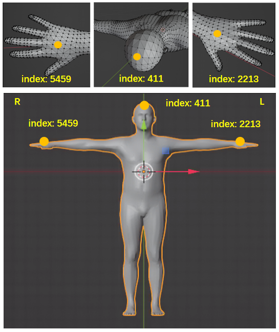

<!-- Author: Xi Luo -->
<!-- Documentation for Human Pose Extraction, Optimization and Retargeting -->
# Human Pose Extraction, Optimization and Retargeting

## Coarse human pose estimation
We utilize [MMHuman3D](https://github.com/open-mmlab/mmhuman3d/tree/main) for estimating the coarse human poses.
1. Prepare MMHuman3D:  
   1. Please follow the [official instructions](https://github.com/open-mmlab/mmhuman3d/blob/main/docs/getting_started.md) for [installation](https://github.com/open-mmlab/mmhuman3d/blob/main/docs/getting_started.md#Installation), [body model preparation](https://github.com/open-mmlab/mmhuman3d/blob/main/docs/getting_started.md#Body-Model-Preparation).  
   2. Choose a pre-trained model and download related resources. We use [HMR](https://github.com/open-mmlab/mmhuman3d/tree/main/configs/hmr/) to run our cases. The file structure is like as:

```text
mmhuman3d
├── mmhuman3d
├── docs
├── demo
├── tests
├── tools
├── configs
└── data
    └── body_models
        ├── J_regressor_extra.npy
        ├── J_regressor_h36m.npy
        ├── smpl_mean_params.npz
        └── smpl
            ├── SMPL_FEMALE.pkl
            ├── SMPL_MALE.pkl
            └── SMPL_NEUTRAL.pkl
```
2. Prepare h^2^tc Data: Download h^2^tc data and fetch the `rgbd0` image folder. 

3. Extract the human body pose: 

```shell
cd mmhuman3d
```
```python
python demo/estimate_smpl.py \
configs/hmr/resnet50_hmr_pw3d.py \
data/checkpoints/resnet50_hmr_pw3d.pth \
--multi_person_demo \
--tracking_config demo/mmtracking_cfg/deepsort_faster-rcnn_fpn_4e_mot17-private-half.py \
--input_path ${DATASET_PATH}/${TAKE_ID}/processed/rgbd0 \
--show_path ${RESULT_OUT_PATH}/${TAKE_ID}.mp4 \ 
--smooth_type savgol \
--speed_up_type deciwatch \
--draw_bbox \
--output ${RESULT_OUT_PATH}
```
`--input_path` is the input image folder. Please specify the `${DATASET_PATH}/${TAKE_ID}`.
`--show_path` will save the visualized results in .mp4 format. Please specify the `${RESULT_OUT_PATH}/${TAKE_ID}.mp4`. 
`--output` is the output folder path. The estimated human body poses will be saved in `${RESULT_OUT_PATH}/inference_result.npz`. 

More detailed configs and explanations are [here](https://github.com/open-mmlab/mmhuman3d/blob/main/docs/getting_started.md#offline-demo)


## Multi-modal based human pose optimization
Considering the presence of visual occlusion, the results of estimated human poses obtained from [MMHuman3D](https://github.com/open-mmlab/mmhuman3d/tree/main) may be coarse, particularly in the arms and hands. However, 
given that the multi-modal data streams collected in our dataset, including the OptiTrack, SMP gloves poses, RGB-D images and so on, users can utilize this information to optimize the estimated human poses.  Here is an example pipeline that demonstrates how OptiTrack streams and SMP glove poses can be used to enhance the estimated human poses.

### Steps:
1. Prepare the h^2^tc data. 
   1. Download the h^2^tc data and process it. 
   2. Follow the [manual calibration instruction](https://github.com/JustLuoxi/pose_reconstruction_and_retargeting/tree/main/cam_calib) to calibrate the camera's extrinsic parameter. 
   3. Place the extrinsic parameters file `CamExtr.txt` in folder `${TAKE_ID}`, like: 
    ```text
    002870
    ├── processed
    └── CamExtr.txt
   ```

2. Prepare the environment
   ```shell
   conda create -n pose python=3.7
   conda activate pose
   conda install pytorch==1.6.0 torchvision==0.7.0 cudatoolkit=10.1 -c pytorch
   pip install matplotlib opencv-python scikit-learn  trimesh  \
   Pillow  pyrender pyglet==1.5.15  tensorboard  \
   git+https://github.com/nghorbani/configer \
   torchgeometry==0.1.2 smplx==0.1.28
   ```
3. Prepare SMPL+H model
(<small>Note: In the last [coarse human pose estimation](#coarse-human-pose-estimation) stage, the mmhuman3d estimates human body poses only. In this stage, we want to recover the body+hands poses, so we use the smplh model.</small>)
   1. Create an account on the [project page](https://mano.is.tue.mpg.de/)
   2. Go to the `Downloads` page and download the `Extended SMPL+H model (used in AMASS)`. 
   3. Unzip the `smplh.tar.xz` to the folder `body_models`.

1. Prepare Pose Prior VPoser
(<small>[VPoser](https://github.com/nghorbani/human_body_prior) is used to regularize the optimized body poses to avoid those impossible poses. </small>)
   1. Create an account on the [project page](https://smpl-x.is.tue.mpg.de/index.html)
   2. Go to the `Download` page and under `VPoser: Variational Human Pose Prior` click on `Download VPoser v1.0 - CVPR'19` (note it's important to download v1.0 and not v2.0 which is not supported and will not work)
   3. Unzip the `vposer_v1_0.zip` to the folder `checkpoints`.


4. File structure:
    ```text
    pose_reconstruction_frommm
    ├── body_models
            └── neutral
            └── female
            └── male
               └── model.npz
    ├── checkpoints
            └── vposer_v1_0
    ├── motion_modeling
    ├── pose_fitting
    ├── utils
    ├── config.py
    ├── fit_h2tc_mm.cfg           # config file
    ├── h2tc_fit_dataset_mm.py
    ├── motion_optimizer.py
    └── run_fitting_mm.py
    ```
5. Run the multi-modal optimizer to optimize the human poses with the OptiTrack data and SMP glove hands data.

```shell
python pose_reconstruction_frommm/run_fitting_mm.py \
@./pose_reconstruction_frommm/fit_h2tc_mm.cfg \
--smplh ./pose_reconstruction_frommm/body_models/male/model.npz \
--data-path ${DATASET_PATH}/${TAKE_ID}/processed/rgbd0 \
--mmhuman ${MMHUMAN3D_OUTPATH}/inference_result.npz \
--out ${OUTPATH} \
```

`./pose_reconstruction_frommm/fit_h2tc_mm.cfg` is the configuration file. 
`--smplh` specifies the smplh human model path. We use the male model by default. You can change the path to specify the female ('female/model.npz') or neutral ('neutral/model.npz') human model. 
`--data-path` specifies the processed h^2^tc image folder, e.g., `root/002870/processed/rgbd0`.
`--mmhuman` specifies the coarse body pose file extracted from [coarse human pose estimation](#coarse-human-pose-estimation), e.g., `root/vis_results/inference_result.npz`.
`--out` specifies the folder path to save the optimized human pose results. The output visualized meshes are saved in `${OUTPATH}/body_meshes_humor`. The results are saved in `${OUTPATH}/results_out/stage2_results.npz`. 

 

### Optimization Algorithm:
  

Given the coarse [MMHuman3D](https://github.com/open-mmlab/mmhuman3d/tree/main) pose estimation $\mathcal{M_{mmh}}$, OptiTrack head and hands tracking points $\mathcal{H}$ and glove hands poses $\Theta_{hand}$, we aim to recover the accurate human poses $\mathcal{M_{acc}}$. Our optimization objective is defined as: 

```math
\min _{\mathcal{M}_{acc}} \mathcal{C}_\text{trk} + \mathcal{C}_\text{wst} +\mathcal{C}_\text{smo}
```


The OptiTrack term, denoted as $\mathcal{C}_\text{trk}$, quantifies the similarity between the posed body model and the OptiTrack points $\mathbf{P}_t = \left \{ \mathbf{d}_t^i \right \}_{i=0}^{3}$ representing the head and hand points at each frame $t$. To compute this term, we utilize the corresponding vertices on the mesh, denoted as $\mathbf{V}_t= \left \{ \mathbf{v}_t^i \right \}_{i=0}^{3}$, where index 411 corresponds to the head OptiTrack data, index 5459 corresponds to the right hand, and index 2213 corresponds to the left hand.

```math
\mathcal{C}_\text{trk} =\lambda _\text{trk}\sum_{t=0}^{T}\sum_{i=0}^{3} \mathop{\min}_{\mathbf{v}_t^i}\left \| \mathbf{v}_t^i- \mathbf{d}_t^i \right \| ^2
```


The wrist cost, denoted as $\mathcal{C}_\text{wst}$, serves two purposes: disambiguating the right/left wrist pose based on hands tracking information and aiding in recovering accurate whole-arm poses even in cases of severe occlusions. To calculate the wrist loss, we utilize the hand OptiTrack pose $\mathbf{O}_t^{\text{hand}} = \left \{ \mathbf{o}_t^h \right \}_{i=0}^1$, where index $h=0$ corresponds to the right wrist and $h=1$ corresponds to the left wrist, respectively.
```math
\mathcal{C}_\text{wri} =\lambda _\text{wri}\sum_{t=0}^{T}\sum_{h=0}^{1}\left \| {\mathbf{v}_\text{wri}}_t^h-\mathbf{o}_t^h \right \|^2
```

where ${\mathbf{v}_\text{wri}}_t^h$ is the SMPLH right/left wrist pose.   

Independent frame-by-frame pose estimation often leads to temporal inconsistency in the estimated poses. To address this issue, we introduce a regularization term, denoted as $\mathcal{C}_\text{smo}$, which ensures the smoothness of the motion recovery and keeps it reasonable. The smoothness term encourages consistency among the 3D joints. It is formulated as follows:    
```math
\mathcal{C}_\text{smo}= \sum_{t=1}^{T}
(\lambda_\text{jp}\sum_{j=1}^{N} \left \| \mathbf{J}_t^j - \mathbf{J}_{t-1}^j \right \|^2   
+\lambda_\text{bl}\sum_{i=1}^{B} ( l_t^i - l_{t-1}^i )^2
)
```
$\mathbf{J}_t$ denotes the joint position at time $t$. The bone lengths $l_t^j$ are calculated using $\mathbf{J}_t^j$ at each step. 


For the hand poses, we have already obtained the ground truth values  $\Theta_{hand}$  using SMP gloves. We directly map these values to SMPLH hand poses. To initialize the optimization process, we use the coarse pose estimation results from MMHuman3D. The weights $\lambda$ are used to determine the contribution of each term in the optimization process.


## Human Motion Retargeting

To animate the human model and retarget the motion to robots, we first transfer the human model motion to general format animation (.fbx). Then we retarget the animation to new rigged models. The operations below demand professional animation skills, including both rigging and skinning techniques. Please check the [rigging and skinning tutorial](https://create.roblox.com/docs/art/modeling/rigging) first to get the know-how. 

### Transform the *smplh* human motions to the general format animations (.fbx)


1. Prepare the environment  
   a. Install [Python FBX](https://download.autodesk.com/us/fbx/20112/fbx_sdk_help/index.html?url=WS1a9193826455f5ff453265c9125faa23bbb5fe8.htm,topicNumber=d0e8312).  
    b. Run the following commands.
    
     ```shell
     cd smplh_to_fbx_animation
     pip install -r requirements.txt
     ```
2. Prepare SMPLH fbx model 
   Follow the [SMPL-X Blender Add-On Tutorial](https://www.youtube.com/watch?v=DY2k29Jef94) to export the Tpose smplh skinned mesh as a rigged model (For convenience, you can export and use the smplx skinned mesh. In this step, smplh and smplx meshes are equivalent as we aim to transfer human motion to .fbx formate animation). Save the female skinned mesh `smplx-female.fbx` and male skinned mesh `smplx-male.fbx` to the folder `./FBX_model`.
3. File structure:
    ```
    SMPL-to-FBX-main
    ├──FBX_model
    |  ├──smplx-female.fbx
    |  └──smplx-male.fbx
    ├──Convert.py   
    ├──FbxReadWriter.py
    ├──SMPLXObject.py
    ├──SmplObject.py
    └──PathFilter.py
    ```
4. Run the following command to start converting.
   ```shell
   python smplh_to_fbx_animation/Convert.py \
   --input_motion_base ${SMPLH_POSE} \
   --fbx_source_path FBX_model/smplx-male.fbx \
   --output_base ${OUT_PATH}
   ``` 
   `--input_motion_base`: specifies the optimized pose path. 
   `--fbx_source_path`: specifies the skinned meshes. We use male mesh by default. 
   `--output_base`: the animation file will be saved in `${OUT_PATH}\fbx_animation.`. You can open it via Blender or Unity 3D.

### Retargeting human motions

We utilize Unity 3D (2022.3.17) to demonstrate the retargeting process. Please refer to the [tutorial video](https://www.youtube.com/watch?v=BEZHVYk6Fa4) for a step-by-step instruction. Here is a brief overview of the steps involved:

1. Rigging the mesh model: Start with a mesh model and bind the mesh vertices to bones. So that we can animate the mesh model by animating its bones. 
2. Specify corresponding skeleton joints: In Unity 3D, after setting the rigged models as `humanoid` in the `animation type`,  the software automatically solves the corresponding skeleton joints between the rigged models A and B.
3. Animation: Follow the instructions provided in the tutorial video. Unity 3D employs the [Linear Blend Skinning (LBS)](http://graphics.cs.cmu.edu/courses/15-466-f17/notes/skinning.html) algorithm for animation.


The video below demonstrates a collection of retargeting results. It shows our pose reconstruction results and retargeting results using jvrc, atlas, icub and pepper robots. You can find the rigged models of these 4 robots in folder `assets\robot_models` (T-pose, .fbx format).   


<div  align='center' style="display: flex; justify-content: center;">

</div  align='center' >
